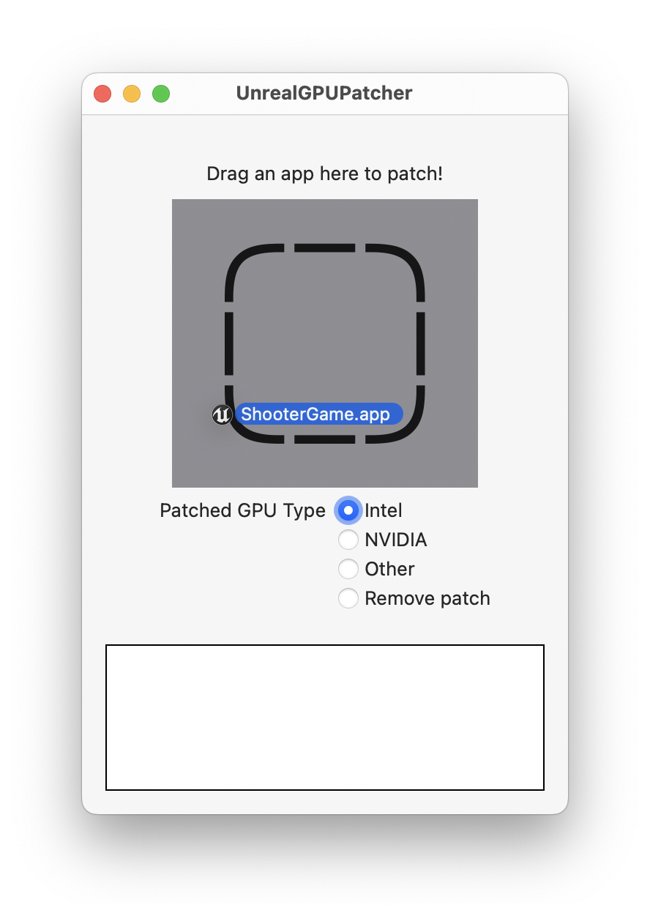
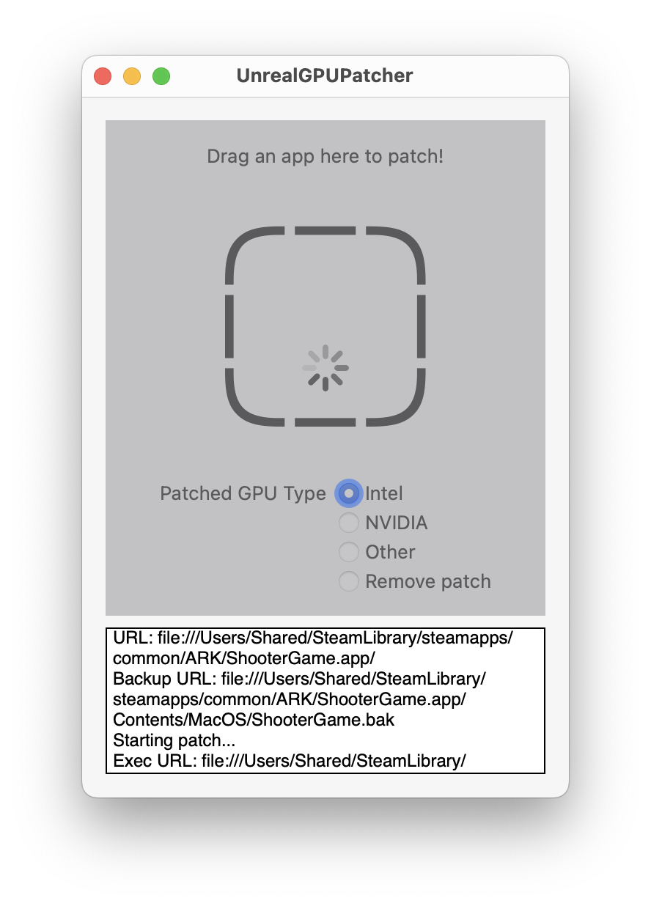
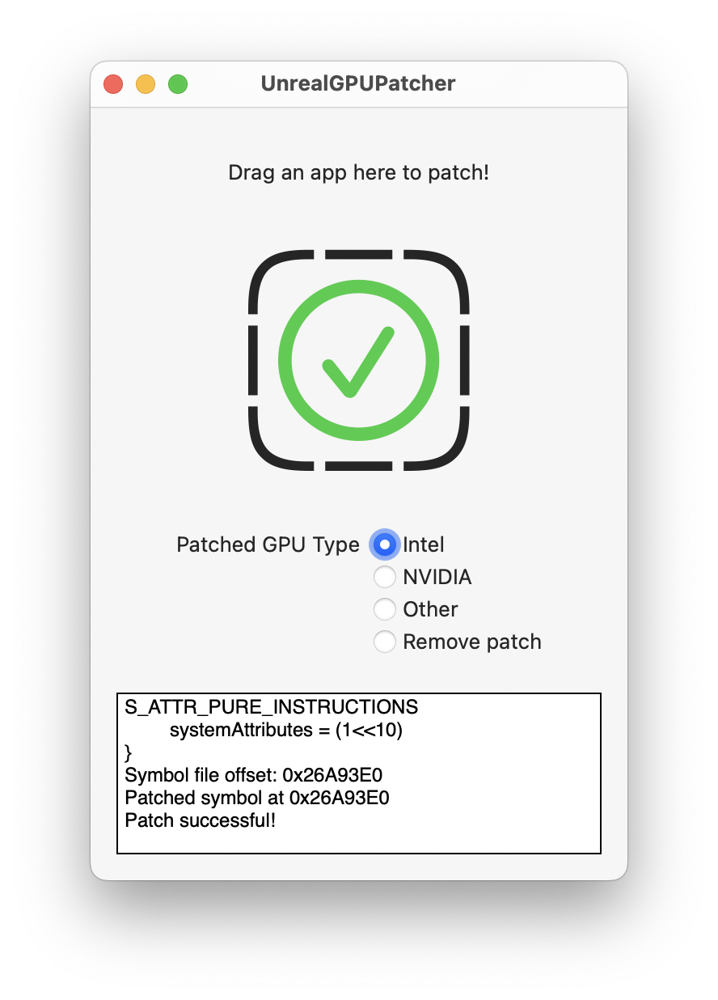

# UnrealGPUPatcher

Patch out the GPU checks for any x86-64 macOS Unreal Engine-based game, particularly [ARK: Survival Evolved](https://store.steampowered.com/app/346110/ARK_Survival_Evolved/).

|  |  |  |
|-|-|-|

## Instructions

1. Download ARK: Survival Evolved on Steam (or any other game using an old version of Unreal Engine built for x86-64 macOS).
2. Navigate to the app in Finder. If you're using Steam: right-click the game in your library, choose "Manage", then "Browse local files".
3. Set the desired GPU type. On my 2021 14" MacBook Pro (M1 Pro), I found that Intel worked best.
4. Drag the app into the patcher and wait for the green checkmark.
5. Launch the game through Steam; the first launch may take up to an hour, please be patient. If you hear the music but don't see any windows, keep waiting.
6. Enjoy!

Note: Since this is a patcher, multiplayer mode will not work for games with anti-cheat.

## Background

In June 2022, the game ARK: Survival Evolved was released for free as part of a promotion on Steam. The game is built for x86-64 and is fully compatible with Intel-based Macs; however, it appeared to be marked "incompatible" with my Apple Silicon laptop. Steam still allowed me to download the game and launch it through Rosetta; however it crashed immediately after launch.

After some investigation, I figured out that the cause of the issue was simply that the game did not recognize Apple's M1 GPU and crashed while attempting to identify it. Therefore, I reasoned it should be possible to patch out the GPU model checks and launch the game otherwise unmodified. Lo and behold, after identifying and patching two functions responsible for checking the GPU model, the game ran successfully!

I posted [a simple patch to Reddit](https://www.reddit.com/r/macgaming/comments/vd2979/ark_survival_evolved_patched_working_on_m1rosetta), and was a bit overwhelmed by the response. I realized this may be a bit more of a widespread issue than I had realized, and people seemed to be using different versions of the game that were incompatible with the basic patch I had made, so I developed this patcher to bypass GPU checks in (theoretically) all Unreal Engine-based games. Enjoy, and use at your own risk!

Disclaimer:

THE SOFTWARE IS PROVIDED "AS IS", WITHOUT WARRANTY OF ANY KIND, EXPRESS OR IMPLIED, INCLUDING BUT NOT LIMITED TO THE WARRANTIES OF MERCHANTABILITY, FITNESS FOR A PARTICULAR PURPOSE AND NONINFRINGEMENT. IN NO EVENT SHALL THE AUTHORS OR COPYRIGHT HOLDERS BE LIABLE FOR ANY CLAIM, DAMAGES OR OTHER LIABILITY, WHETHER IN AN ACTION OF CONTRACT, TORT OR OTHERWISE, ARISING FROM, OUT OF OR IN CONNECTION WITH THE SOFTWARE OR THE USE OR OTHER DEALINGS IN THE SOFTWARE.

## Technical Details

Unreal Engine uses a custom ["Render Hardware Interface" (RHI)](https://docs.unrealengine.com/4.27/en-US/ProgrammingAndScripting/Rendering/ParallelRendering/) to abstract over various platforms, storing a GPU "vendor ID" in the `GRHIVendorId` global variable. Certain older versions of the engine leave this variable set to zero for unknown GPUs; however certain methods, particularly [`bool IsRHIDeviceIntel()`](https://github.com/EpicGames/UnrealEngine/blob/6da593520c603a368ec1e144e630dd202ea12ab4/Engine/Source/Runtime/RHI/Private/RHI.cpp#L1178-L1183) and [`bool IsRHIDeviceNVIDIA()`](https://github.com/EpicGames/UnrealEngine/blob/6da593520c603a368ec1e144e630dd202ea12ab4/Engine/Source/Runtime/RHI/Private/RHI.cpp#L1185-L1190), contain assertions that that the vendor ID is nonzero. ([see here to access the Unreal Engine source code](https://www.unrealengine.com/en-US/ue-on-github))

The reason for intentionally crashing the game on unknown GPUs eludes me, and there is no way to disable this behavior. Therefore, this program works by patching those methods to always return a predefined value. See `Patcher.swift` for details.
